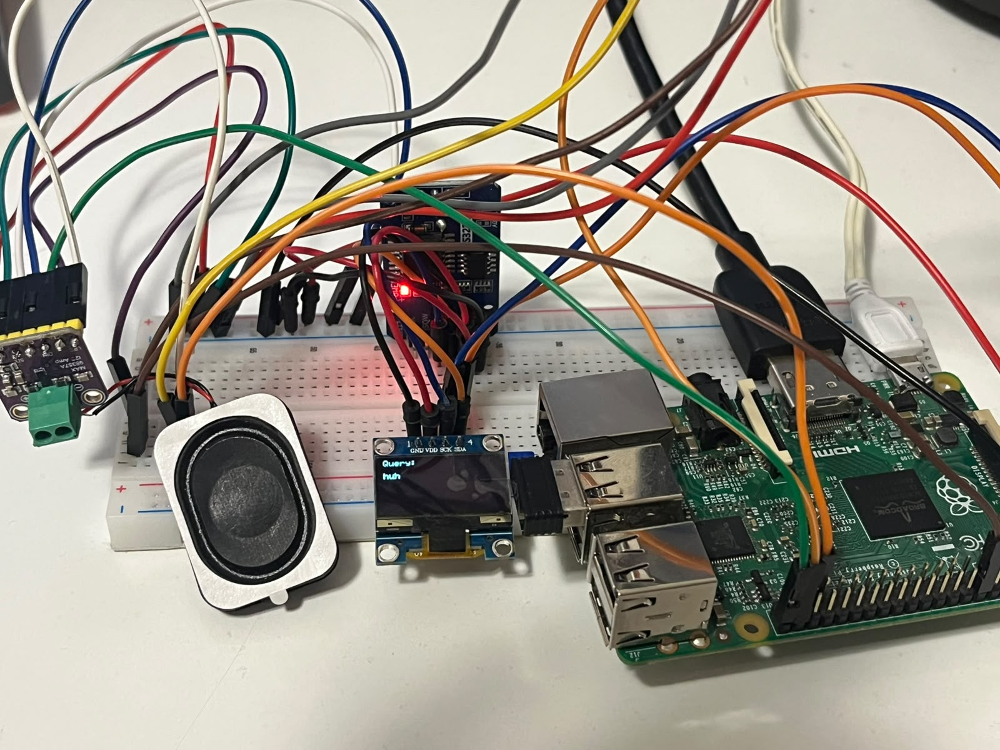
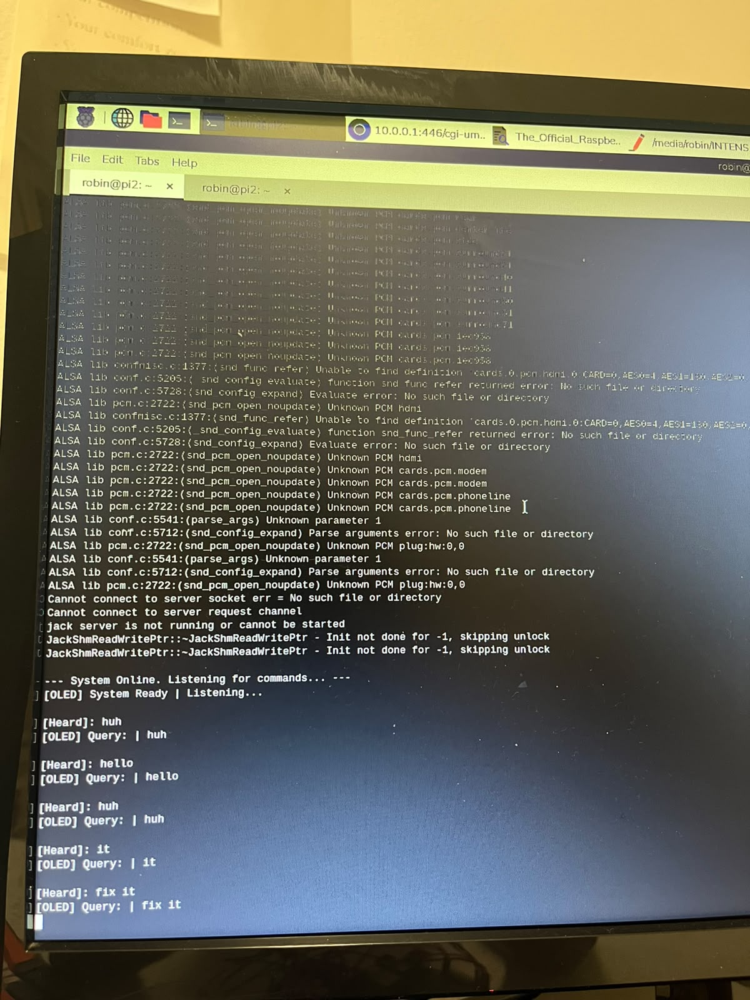
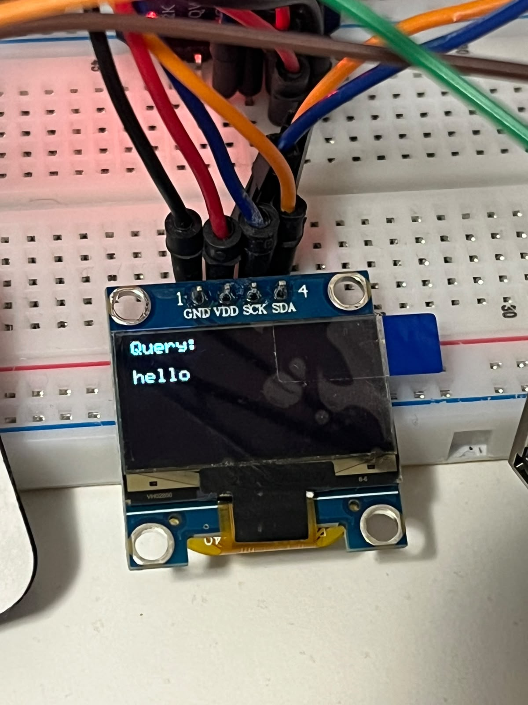

# Embedded Linux Voice Assistant — Raspberry Pi 2

An offline voice assistant built from scratch on a Raspberry Pi 2, combining
raw I2C hardware interfacing with a proper Linux kernel driver binding —
built to demonstrate hands-on embedded Linux development from the kernel
down to the hardware.



## Why this project

Most beginner Pi projects use high-level libraries (`luma.oled`, `smbus`
wrappers) that hide what's actually happening on the bus. This project
deliberately avoids that: the OLED and RTC are driven with raw I2C register
writes following their datasheets directly, and the RTC is additionally
bound to Linux's own `rtc-ds1307` kernel driver via a custom device tree
overlay — so the same physical chip is accessible through two different
levels of abstraction, from user-space I2C calls up to the standard kernel
RTC subsystem (`/dev/rtc0`).

## Hardware

| Component | Interface | Notes |
|---|---|---|
| Raspberry Pi 2 | — | Host board |
| SSD1306 OLED (128x64) | I2C, addr `0x3C` | Raw register writes, no display library |
| DS3231 RTC | I2C, addr `0x68` | Raw I2C + kernel driver (`rtc-ds1307`) |
| INMP441 I2S MEMS microphone | I2S | Audio input |
| MAX98357A I2S amplifier | I2S | Audio output |

### Wiring

**OLED (SSD1306)**

| OLED pin | Pi pin |
|---|---|
| VCC | Pin 1 (3.3V) |
| GND | Pin 6 |
| SCL/SCK | Pin 5 (GPIO3) |
| SDA | Pin 3 (GPIO2) |

**DS3231 RTC** — shares the OLED's I2C bus (same VCC/GND/SDA/SCL rails)

**INMP441 (mic)**

| Pin | Pi pin |
|---|---|
| VDD | Pin 1 |
| GND / L-R | Pin 6 |
| WS | Pin 35 (GPIO19) |
| SCK | Pin 12 (GPIO18) |
| SD | Pin 38 (GPIO20) |

**MAX98357A (speaker amp)**

| Pin | Pi pin |
|---|---|
| VIN | Pin 2 (5V) |
| GND | Pin 6 |
| BCLK | Pin 12 (shared with mic) |
| LRC | Pin 35 (shared with mic) |
| DIN | Pin 40 (GPIO21) |
| SD, GAIN | Tied to VIN |

## Two levels of hardware access

**1. Raw I2C (user space)** — `src/ds3231_read.py`, `src/ds3231_set.py`,
`src/oled_display.py` talk directly to `/dev/i2c-1` using `smbus2`,
manually setting register addresses, BCD conversion for the RTC, and
page/column addressing for the OLED — no abstraction layer.

**2. Kernel driver binding** — adding

```
dtoverlay=i2c-rtc,ds3231
```

to `/boot/firmware/config.txt` and rebooting causes the kernel's built-in
`rtc-ds1307` driver to claim the DS3231, exposing it as `/dev/rtc0` and
through `/sys/class/rtc/rtc0/time` — the same standard interface any Linux
system uses for its hardware clock. Verified via:

```bash
dmesg | grep -i rtc
cat /sys/class/rtc/rtc0/time
```

Note: once the kernel driver owns the device, raw I2C writes from Python
will fail with `Device or resource busy` — time must be set from then on
via `sudo date -s` + `sudo hwclock -w`.



## Voice assistant

`src/voice_loop.py` ties everything together:

- **Vosk** for fully offline speech recognition (switched from Whisper,
  which has no pre-built wheels for 32-bit ARM and needs a Rust toolchain
  to compile — a poor fit for the Pi 2)
- **espeak-ng** + `aplay` for text-to-speech output
- Reads the RTC through the kernel path (`/sys/class/rtc/rtc0`)
- Command matching: "time", "date", "shutdown"/"exit"

Audio hardware runs natively at 48kHz; input is downsampled to 16kHz in
software before being passed to Vosk's recognizer.



## Setup

```bash
git clone https://github.com/Faizul6/pi-embedded-voice-assistant.git
cd pi-embedded-voice-assistant

# Enable I2C and I2S on the Pi (raspi-config or /boot/firmware/config.txt)
# Add to /boot/firmware/config.txt:
#   dtoverlay=i2c-rtc,ds3231
#   dtparam=i2s=on
#   dtoverlay=googlevoicehat-soundcard

pip3 install smbus2 vosk pyaudio numpy --break-system-packages

# Download a Vosk model (not included in this repo — too large):
# https://alphacephei.com/vosk/models
# e.g. vosk-model-small-en-us-0.15, place in project root

python3 src/voice_loop.py
```

## Challenges faced

- **Whisper wouldn't build on 32-bit ARM** — `tiktoken` requires compiling
  Rust dependencies with no pre-built wheel for ARMv7. Switched to Vosk,
  which ships pre-built ARM wheels and is designed for resource-constrained
  offline devices.
- **RTC "wrong time" bug** — `/sys/class/rtc/rtc0/time` reports raw UTC by
  kernel design, while `date` shows local time (CEST, UTC+2). This looked
  like a bug but was the RTC working correctly; fixed by converting
  UTC to local time in software before displaying/speaking it.
- **Audio sample rate mismatch** — the I2S hardware's native rate is 48kHz,
  not the 16kHz Vosk expects; fixed with software downsampling.

## Future work

- Wake-word detection instead of always-listening capture
- Lightweight on-device LLM for open-ended queries beyond fixed keywords
